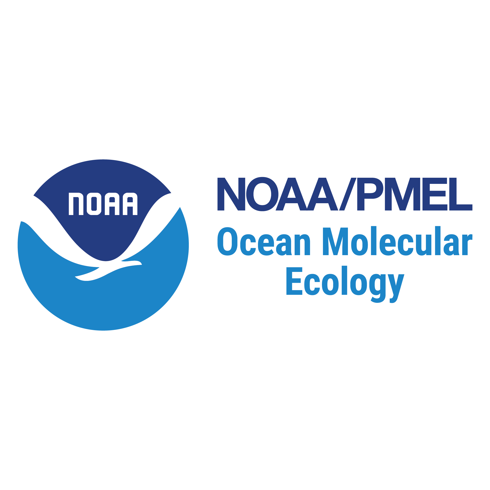

Home for NOAA Pacific Marine Environmental Laboratory Ocean Molecular Ecology group bioinformatics and data analysis.  

## Authors
[Zachary Gold](https://github.com/marinednadude/)  
[Sean McAllister](https://github.com/McAllister-NOAA/)  
[Shannon Brown](https://github.com/Brown-NOAA) 
[Han Weinrich](https://github.com/HanWeinrich) 
[Sam Setta](https://github.com/DiatomSetta) 
[Brynn Zalmanek](https://github.com/brynnz22)

## Zenodo Archive
[NOAA/PMEL Ocean Molecular Ecology Zenodo Community](https://zenodo.org/communities/noaa_ome/)

## Protocols

### eDNA Sample Collection Protocols
|Type|
|--------|
|[NOAA PMEL OME eDNA Collection Protocol](https://github.com/marinednadude/NOAA-PMEL-OME_eDNA_Collection_Protocol_CTD/blob/34e0e067043efa2bf1a83b1f9e517a58d44f69d6/NOAA-PMEL-OME_eDNA_Collection_Protocol_CTD.md)|

### Extraction Protocols
|Type|
|--------|
|[Sterivex Extraction Protocol](https://github.com/marinednadude/NOAA-PMEL-OME_Extraction_Protocol_Sterivex_Centrifuge/blob/main/NOAA-PMEL-OME_Extraction_Protocol_Sterivex_Centrifuge.md)|

### PCR Protocols
|Marker|
|--------|
|[Parada universal 16S](https://github.com/marinednadude/NOAA-PMEL-OME-Parada-universal-16S-PCR-Protocol-BeBOP/blob/main/NOAA-PMEL-OME-Parada-universal-16S-PCR-Protocol-BeBOP.md) |
|[Stoeck phytoplankton 18S V4](https://github.com/marinednadude/NOAA-PMEL-OME-Stoeck-phytoplankton-18S-V4-PCR-Protocol-BeBOP/blob/main/NOAA-PMEL-OME-Stoeck-phytoplankton-18S-V4-PCR-Protocol-BeBOP.md)|
|[AmaralZettler phytoplankton 18S V9](https://github.com/marinednadude/NOAA-PMEL-OME-AmaralZettler-phytoplankton-18S-V9-PCR-Protocol-BeBOP/blob/main/NOAA-PMEL-OME-AmaralZettler-phytoplankton-18S-V9-PCR-Protocol-BeBOP.md)|
|[MiFish modified Universal Teleost 12S](https://github.com/marinednadude/NOAA-PMEL-OME-MiFish-mod-Universal-Teleost-12S-PCR-Protocol-BeBOP/blob/main/NOAA-PMEL-OME-MiFish-mod-Universal-Teleost-12S-PCR-Protocol-BeBOP.md)|
|[LF metazoan COI](https://github.com/marinednadude/NOAA-PMEL-OME-LF-metazoan-COI-PCR-Protocol-BeBOP/blob/main/NOAA-PMEL-OME-LF-metazoan-COI-PCR-Protocol-BeBOP.md)|
|[Baker marine mammal dLoop](https://github.com/marinednadude/NOAA-PMEL-OME-Baker-marmam-dLoop-PCR-Protocol-BeBOP/blob/main/NOAA-PMEL-OME-Baker-marmam-dLoop-PCR-Protocol-BeBOP.md)|
|[Kelly Metazoan 16S](https://github.com/marinednadude/NOAA-PMEL-OME-Kelly-Metazoan-16S-PCR-Protocol-BeBOP-/blob/main/NOAA-PMEL-OME-Kelly-Metazoan-16S-PCR-Protocol-BeBOP.md)|
|[White Sterling Phytoplankton ITS1](https://github.com/marinednadude/NOAA-PMEL-OME-WhiteSterling-phytoplankton-ITS1-PCR-Protocol-BeBOP/blob/main/NOAA-PMEL-OME-WhiteSterling-phytoplankton-ITS1-PCR-Protocol-BeBOP.md)|
|[Machida Metazoan 18S V8](https://github.com/marinednadude/NOAA-PMEL-OME-Machida-Metazoan-18S-V8-PCR-Protocol-BeBOP/blob/main/NOAA-PMEL-OME-Machida-Metazoan-18S-V8-PCR-Protocol-BeBOP.md)|

## Bioinformatics & Data Analysis Repositories
Metabarcoding Pipeline and Visualization software - [REVAMP](https://github.com/McAllister-NOAA/REVAMP)  
Reference Database Generating Tool - [rCRUX](https://github.com/CalCOFI/rCRUX)  

## Data Management
[NOAA 'Omics Draft Data Management Guidelines](https://github.com/aomlomics/omics-data-management)  

## Suggested Links

### Manuscripts
[Gold et al. 2023 Code - Ichthyoplankton from CalCOFI Ethanol Preservative](https://github.com/CalCOFI/CalCOFI_eDNA)  
[Gold et al. 2023 Code - Signal and Noise from Metabarcoding data](https://github.com/zjgold/Metabarcodings_Signal_from_Noise)  
 

### NOAA Collaborators
[AOML 'Omics GitHub](https://github.com/aomlomics/)  
[GLERL Github](https://github.com/NOAA-GLERL)  
[CalCOFI Github](https://github.com/CalCOFI/)  
[West Coast Ocean Biomolecular Observation Network](https://evsatt.github.io/WC-OBON_Website/)  

### Disclaimer
This repository is a scientific product and is not official communication of the National Oceanic and
Atmospheric Administration, or the United States Department of Commerce. All NOAA GitHub project
code is provided on an ‘as is’ basis and the user assumes responsibility for its use. Any claims against the
Department of Commerce or Department of Commerce bureaus stemming from the use of this GitHub
project will be governed by all applicable Federal law. Any reference to specific commercial products,
processes, or services by service mark, trademark, manufacturer, or otherwise, does not constitute or
imply their endorsement, recommendation or favoring by the Department of Commerce. The Department
of Commerce seal and logo, or the seal and logo of a DOC bureau, shall not be used in any manner to
imply endorsement of any commercial product or activity by DOC or the United States Government.

